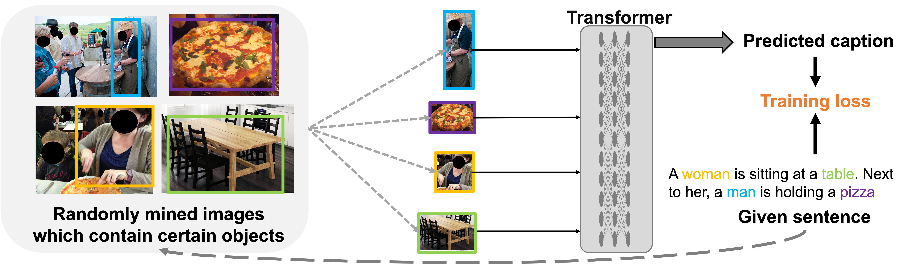

# obj-centric-unsup-caption
Official Pytorch Implementation of the paper: Object-Centric Unsupervised Image Captioning (ECCV2022)



## Requirements
* Python 3
* Pytorch 1.5+
* [coco-caption](https://github.com/tylin/coco-caption) (Follow initialization steps in coco-caption/README.md)

## Prepare data
All the data needed to run the code can be downloaded from [Here](https://drive.google.com/drive/folders/1BS9Eo4zLCcqCg96E3btnWTmswCbxtFw_?usp=sharing).

Data needed for evaluation (using Localized Narratives captions on COCO): Download 'captions_LN_val2014_norepeat.json' and put it in 'path_to/coco-caption/annotations/'

Data needed for training: Download all the data from the above link and put them in './data'. OR do the following steps for preprocessing:
1. Download 'coco_Dataset.json' and 'Dataset_label.h5' (Dataset is GCC/SS) which contain the image dataset info and text dataset info.
2. Download 'box_only.zip' and 'feats_only.zip' which contain the features of COCO images. OR you can extract by yourself using [Detectron2](https://github.com/lichengunc/detectron2/tree/genome_obj+attr).
3. Download 'objects_vocab.txt' (the object category names) then use this script to generate the rest needed data (extract the visual object tokens for each image and construct object-to-image-mapping).
   ```python
   python preprocessing/construct_obj_to_img_map.py
   ```

## Training and testing
```
bash run.sh
```
('run.sh' contains the command to train/test for both GCC/SS)

## Acknowledgements
Some components of this repo were built from [ImageCaptioning.pytorch](https://github.com/ruotianluo/ImageCaptioning.pytorch) and [connect-caption-and-trace
](https://github.com/facebookresearch/connect-caption-and-trace).

